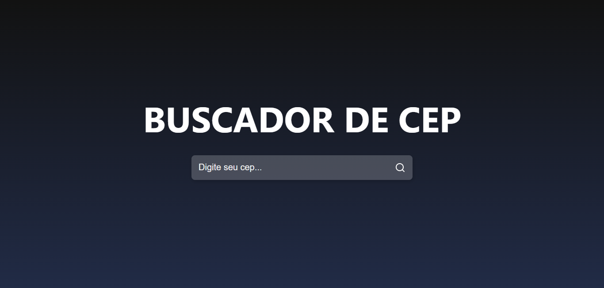

# Buscador de CEP



## Tecnologias utilizadas

- ReactJS
- Axios

# Preview
[](https://app.netlify.com/sites/buscacep123/deploys)

[Busca Cep](https://buscacep123.netlify.app/)

## Rodando o projeto localmente

Clone este repositório

```bash
  git clone https://github.com/luiz-gustavo0/buscador-cep.git
```

Vá até a pasta do projeto

```bash
  cd buscador-cep
```

Instale as dependências

```bash
  npm install ou yarn install
```

## Author

[@luiz-gustavo0](https://linkedin.com/in/luiz-gustavo0)
